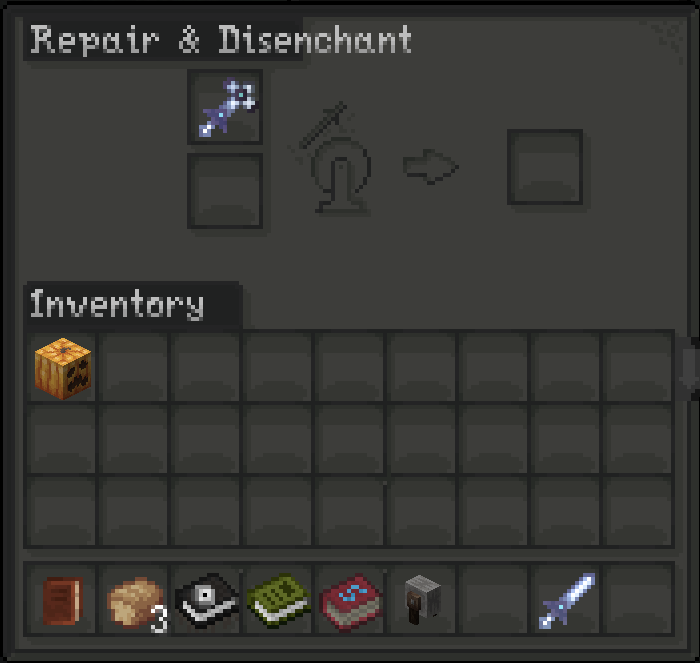
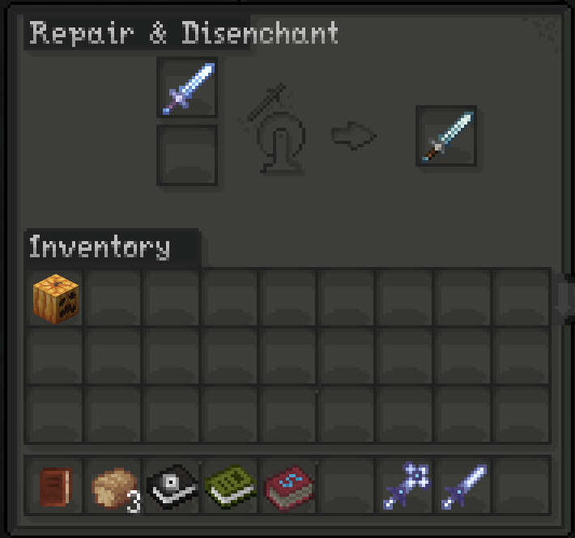

# Grindstone Blacklist

Grindstone Blacklist is a small Forge mod for Minecraft `1.20.1` that lets you prevent specific items from being used in a grindstone.

The mod reads a configurable list of item IDs and blocks those items from producing a grindstone output.

## Features

* Prevents configured items from being used in a grindstone
* Uses a simple server-side config file
* Supports modded items
* No mixins required
* Lightweight and focused

## Example Images





## Requirements

This mod is built for:

* Minecraft `1.20.1`
* Forge `47.x`
* Java `17`

## Configuration

The blacklist is controlled by a server config file.

After launching the game once, the config will be generated at:

```txt
saves/<world>/serverconfig/grindstoneblacklist-server.toml
```

On a dedicated server, it will be located at:

```txt
world/serverconfig/grindstoneblacklist-server.toml
```

For modpack defaults, place the config here:

```txt
defaultconfigs/grindstoneblacklist-server.toml
```

## Example Config

```toml
[grindstoneblacklist]
blacklisted_items = [
    "evilhunter:true_silver_sword",
    "evilhunter:ritual_sword"
]
```

Use full item IDs in the format:

```txt
modid:item_name
```

## Behavior

Blacklisted items can still be placed into the grindstone input slots, but they will not produce a valid output. This prevents the item from being disenchanted, repaired, or otherwise processed through the grindstone.

## License

This project is licensed under the MIT License.
